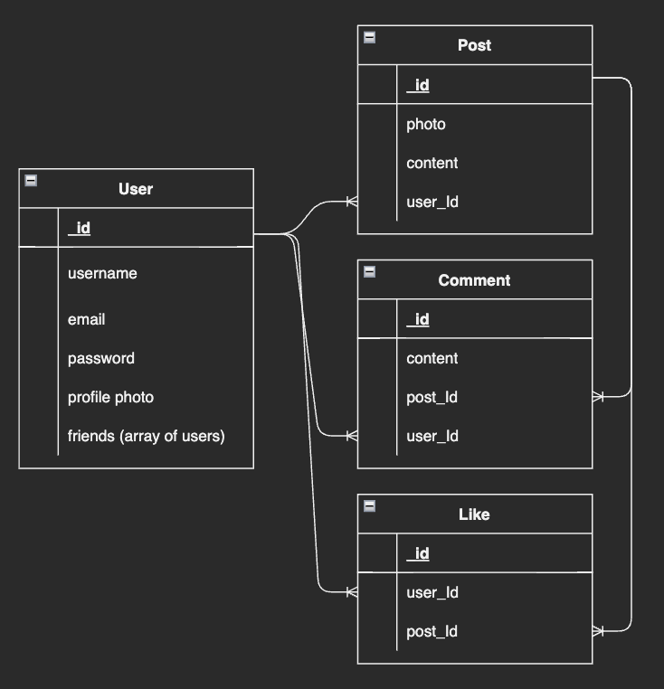
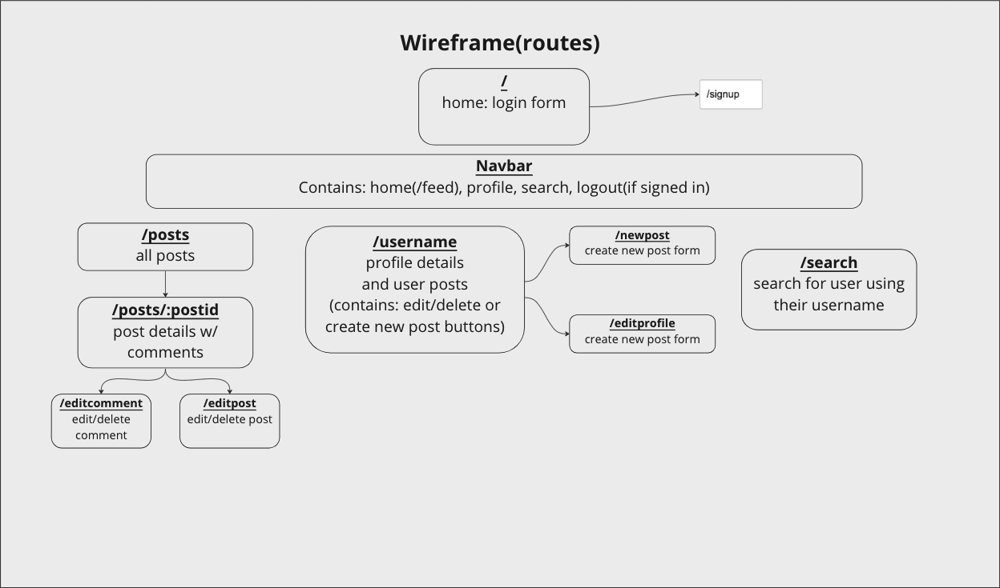
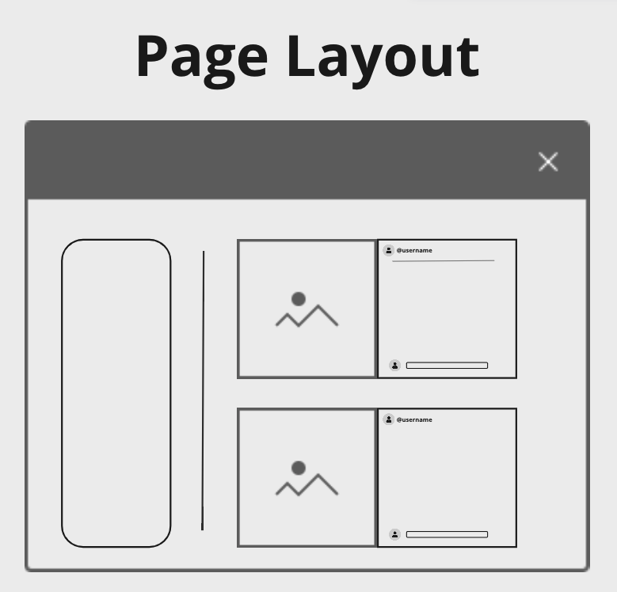

# PetSpace

## Project idea and description
MyPetSpace is an online photo-sharing social media application specifically for pets!
Our application aims to create a platform that allows users to share and connect their furry friends to the rest of the world. Users can upload photos to our application and share them with their followers or with a select group of friends.
Users can also view, comment and like posts created by their friends.

## App Link

## Tech Used
- CSS/Bootstrap
- JavaScript
- Node
- Express
- Axios
- REACT
- MongoDB
- Mongoose

## ERDs

## Restful Routing Chart
### User Routes
| Method | Path | Purpose |
| ------ | -------------- | -------------------------------- |
| GET | `/` | home page that ask user to login/signup|
| GET | `/signup/` | user signup page |
| POST | `/login/` | accept a payload of form data and use it log a user in, then redirects back to `GET /feed` |
| POST | `/` | creates a new user, then redirects to `GET /:username` |
| GET | `/:username/` | user profile page |
| GET | `/:username/edit/` | user profile edit page |
| PUT | `/:username/` | update user's profile, then redirect to `GET /:username`|
| DELETE | `/:username/` | delete user profile page, then redirect to `GET /` |
| GET | `/search/` | user profile page |

### Post Routes
| Method | Path | Purpose |
| ------ | -------------- | -------------------------------- |
| GET | `/posts/` | show your friends' posts|
| POST | `/posts` | creates a new post, then redirects to `GET /posts` |
| GET | `/posts/:postid` | show a specific post|
| PUT | `/posts/:postid` | update a post, then redirect to `GET /posts`|
| DELETE | `/postscode/:postid` | delete a post, then redirect to `GET /posts` |

### Comment Routes
| Method | Path | Purpose |
| ------ | -------------- | -------------------------------- |
| POST | `/post/:postid/comment` | add a comment to a specific post, then redirects to `GET /post/:postid`|
| PUT | `/post/:postid/comment/:commentid` | add a comment to a specific post, then redirects to `GET /post/:postid`|
| DELETE | `/post/:postid/comment/:commentid` | delete a specific comment, then redirects to `GET /posts`|

## Wireframe

#### Page Layout

## User Stories
- As a user, I want to create a page for my pet.
- As a user, I want to create posts on my pets account.
- As a user, I want to search for other pets.
- As a user, I want to follow/unfollow my friends.
- As a user, I want to edit a post.
- As a user, I want to delete a post.
- As a user, I want to like a post.
- As a user, I want to comment on a post.
- As a user, I want to edit my comment.
- As a user, I want to delete my comment.
- As a non-user, I will be able to create an account.

## MVP Goals
- Render main feed for user
- Render users personal profile with their posts
- Homepage with sign up/login if no current user signed in
- Allow user to create/edit/delete their account
- Allow user to create/edit/delete their post(s)
- Allow user to create/edit/delete their comment(s)
- Allow user to like/unlike a post
- Allow user to search for other users and follow/unfollow

## Stretch Goals
- allow user to upload a profile pic
- Render a page of random posts
- give user ability to turn profile to private
- allow user to dm another user